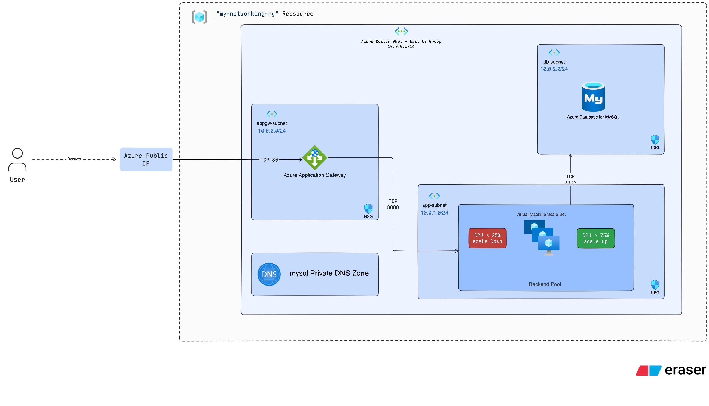

# Azure Web Application Infrastructure with Terraform

This project provisions and runs a lightweight Node.js web application on Azure using Terraform. The target architecture places the application behind an Azure Application Gateway, runs the application on a Linux Virtual Machine Scale Set, and stores application data in Azure Database for MySQL Flexible Server using private networking.

## Architecture



```text
Internet
  -> Azure Application Gateway
  -> Linux Virtual Machine Scale Set
  -> Azure Database for MySQL Flexible Server
```

## Project Structure

```text
.
├── index.js
├── package.json
├── package-lock.json
├── README.md
└── terraform
    ├── main.tf
    ├── variables.tf
    ├── terraform.tfvars
    ├── ressource-group.tf
    └── modules
        ├── networking
        ├── Compute
        └── Database
```

## Application

The application is a lightweight Express.js service listening on port `8080`.

Available endpoints:

```text
GET  /              Web page with a message form
GET  /health        Health check endpoint
GET  /api/info      Application metadata
GET  /api/messages  List latest messages
POST /api/messages  Store a message
POST /messages      Store a message from the web form
```

The app stores submitted messages with:

```text
id
name
message
created_at
```

When MySQL environment variables are configured, messages are stored in Azure Database for MySQL Flexible Server. When no database configuration is present, the app falls back to in-memory storage for local development.

## Application Environment Variables

```text
PORT=8080
DB_HOST=<mysql-hostname>
DB_PORT=3306
DB_USER=<mysql-admin-user>
DB_PASSWORD=<mysql-password>
DB_NAME=<database-name>
DB_SSL=true
```

`DB_SSL` is enabled by default. Set `DB_SSL=false` only when testing against a local or non-SSL MySQL instance.

## Local Development

Install dependencies:

```bash
npm install
```

Run the app:

```bash
npm start
```

The application starts on:

```text
http://localhost:8080
```

## Terraform Overview

Terraform is organized into three main modules:

```text
networking  Creates the VNet, subnets, NSGs, public IP, and Application Gateway
Compute     Creates the Linux Virtual Machine Scale Set
Database    Creates Azure Database for MySQL Flexible Server and private DNS
```

### Networking Module

The networking module creates:

```text
Virtual Network
Application Gateway subnet
Application subnet
Database subnet
Application Gateway NSG
Application subnet NSG
Database subnet NSG
Application Gateway public IP
Application Gateway backend pool
Application Gateway health probe
Application Gateway routing rule
```

The database subnet is delegated to:

```text
Microsoft.DBforMySQL/flexibleServers
```

This delegation is required for Azure Database for MySQL Flexible Server with private VNet integration.

### Compute Module

The compute module creates a Linux Virtual Machine Scale Set in the application subnet. The VMSS is attached to the Application Gateway backend pool so traffic can flow from the internet through the gateway to the application instances.

Expected responsibilities:

```text
Create Linux VMSS instances
Attach NICs to the app subnet
Register instances with the Application Gateway backend pool
Configure SSH access
Install and run the Node.js application
Expose the app on the expected backend port
```

### Database Module

The database module creates:

```text
Azure Database for MySQL Flexible Server
MySQL database
Private DNS zone
Private DNS zone virtual network link
```

The MySQL server uses:

```hcl
delegated_subnet_id = var.db_subnet_id
private_dns_zone_id = azurerm_private_dns_zone.mysql.id
```

This keeps database access private inside the virtual network.

## Terraform Inputs

Important root variables include:

```text
rg_name
location
vnet_cidr
appgw_subnet_cidr
app_subnet_cidr
db_subnet_cidr
app_gateway_name
vmss_name
vm_admin_username
ssh_public_key
mysql_server_name
db_admin_username
db_admin_password
db_name
```

Sensitive values such as SSH keys and database passwords should be provided through `terraform.tfvars`, environment variables, or a secure CI/CD secret store.

## Terraform Outputs

Important outputs should include:

```text
Application Gateway public IP
Application subnet ID
Database subnet ID
Application Gateway backend pool ID
VNet ID
MySQL server FQDN
Database name
VMSS ID
```

These outputs allow modules to connect to each other and make important deployment information visible after provisioning.

## Deployment Flow

1. Create the resource group.
2. Create networking resources.
3. Create the Application Gateway and related NSG rules.
4. Create the delegated database subnet.
5. Create Azure Database for MySQL Flexible Server with private access.
6. Create the Linux Virtual Machine Scale Set.
7. Attach VMSS instances to the Application Gateway backend pool.
8. Configure the app with MySQL connection environment variables.
9. Access the application through the Application Gateway public IP.

## Security Notes

The intended security model is:

```text
Internet can reach only the Application Gateway listener.
Application Gateway can reach the VMSS application port.
Application subnet can reach MySQL on port 3306.
MySQL is not publicly accessible.
SSH access should be restricted to trusted public IP addresses or replaced by Azure Bastion.
```

Avoid committing real passwords, private keys, or production secrets to the repository.

## Current Implementation Notes

Before applying the infrastructure, verify these details:

```text
The Application Gateway backend port matches the port used by the app.
The VMSS startup script actually deploys and starts the Node.js app.
The MySQL server name is globally unique in Azure.
The database admin username is valid for Azure MySQL.
The SSH source IP rule is restricted to your own public IP.
The architecture image path in this README matches the actual exported image filename.
```
